# Outline

## 1. US landscape of minimum wages
 
## 2. Review of minimum wage research
 
## 3. Labor market adjustments

---
class: inverse, center, middle
# Minimum wage landscape
---

# Federal minimum wage in 2022$
.center[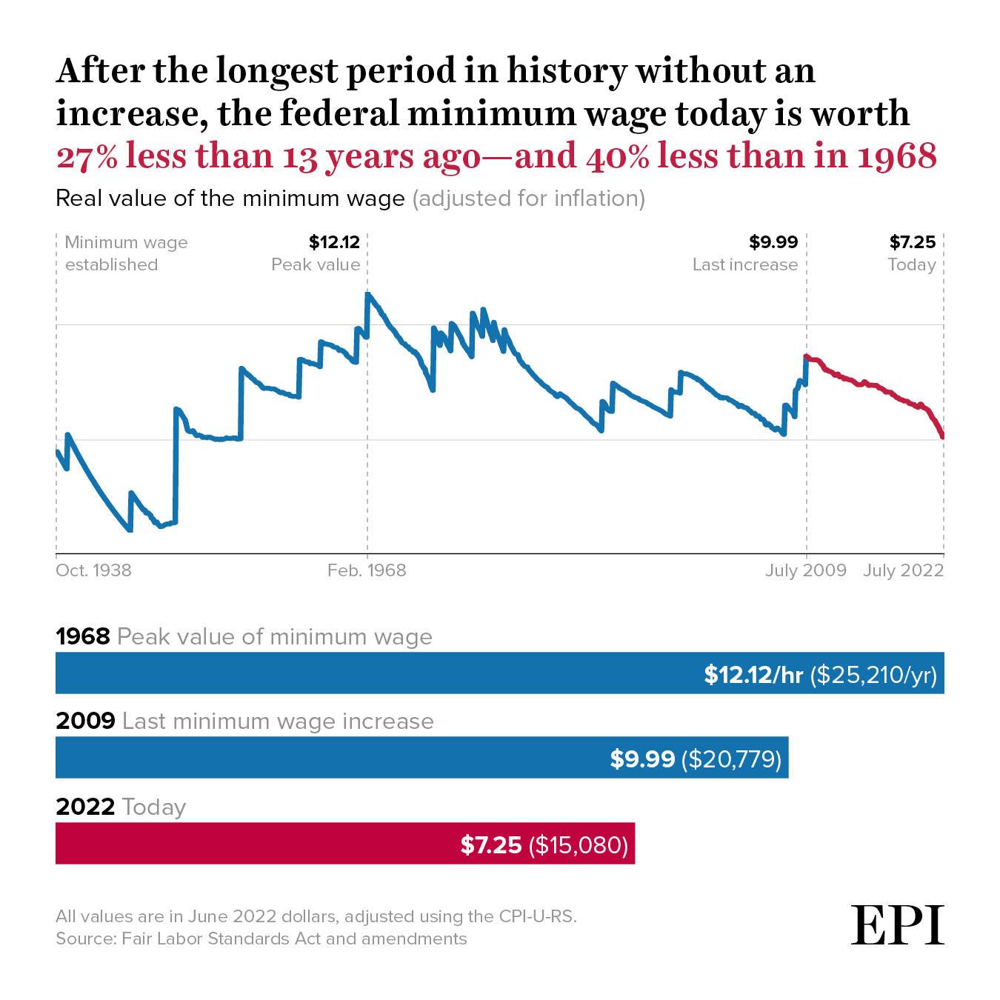]
---

# Current state of minimum wages
.pull-left[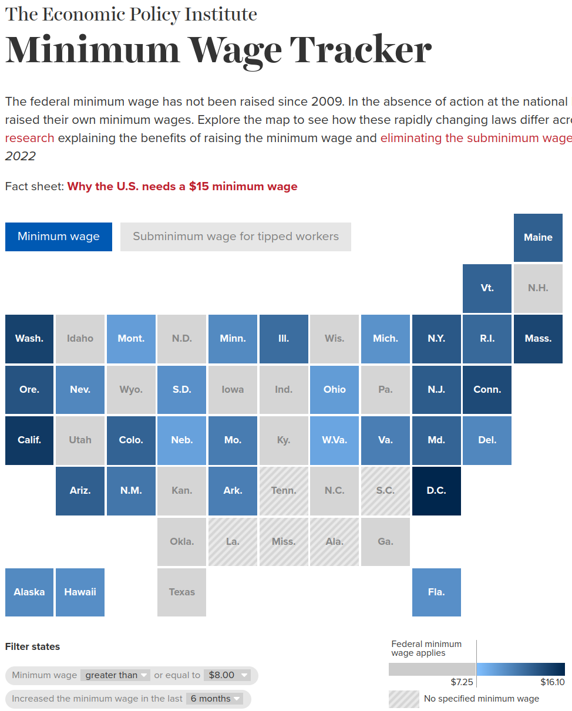]

.pull-right[
### Two countries
  - 20 states still follow federal minimum wage
  - 40% of workforce in states/cities scheduled to reach $15
  - 22 states have tipped subminimum wage less than $3.00
  - 8 states where tipped = regular minimum
]

---
class: inverse, center, middle
# Review of minimum wage research
---

# Minimum wage research before 1990s
* Typically large, negative employment effects, especially on younger
workers (teenagers)

* Younger workers do see a significant hourly wage increase, but the
loss in employment causes them to have no annual income gains

* Convinced economists that minimum wage was at best ineffective, at
worst harmful

.center[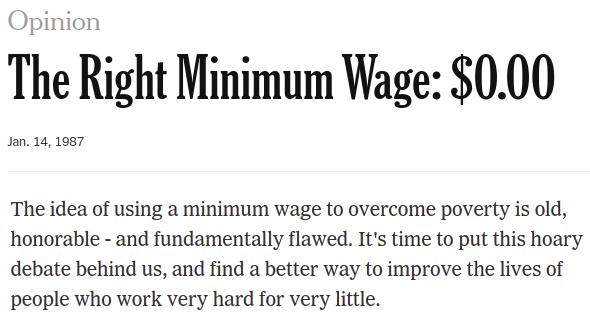]

---
# High and low state minimum wages
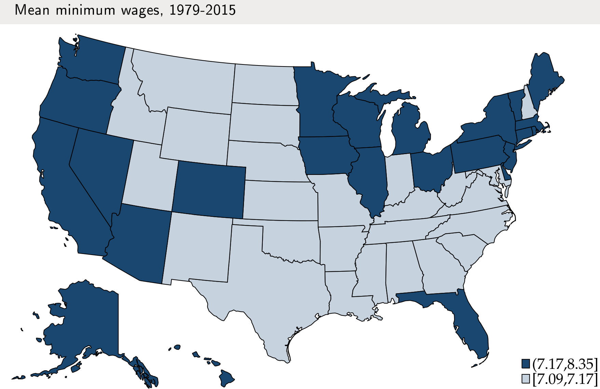

---
# Card & Krueger 1994 NJ-PA comparisons
.center[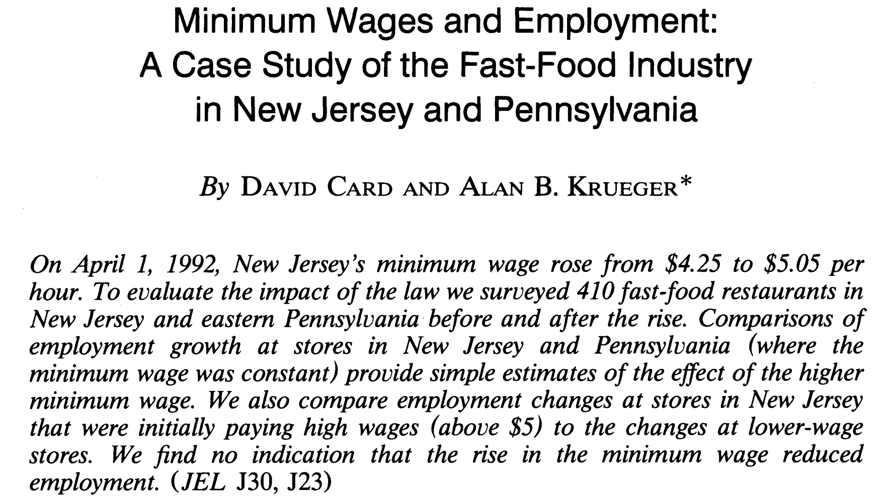]

* Fast-food employment change in New Jersey (treated group): $\Delta \textrm{NJ} = \textrm{NJ}_\textrm{after} - \textrm{NJ}_\textrm{before}$

* Fast-food employment change in Pennsylvania (control group): $\Delta \textrm{PA} = \textrm{PA}_\textrm{after} - \textrm{PA}_\textrm{before}$

* Estimated effect of minimum wage = $\Delta \textrm{NJ} - \Delta \textrm{PA}$

---
# Card & Krueger NJ-PA comparisons
.center[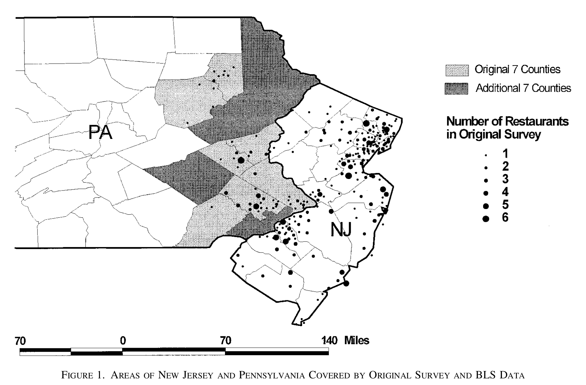]

**"The increase in New Jersey's minimum wage probably had no effect on total employment in New Jersey's fast-food industry, and possibly had a small positive effect."**

Card and Krueger, *American Economic Review*, 2000

---
# Generalizing NJ-PA comparison
* Most important objection to NJ-PA study: only one case study
* Dube Lester Reich (2010) generalized the approach to minimum wage increases in 300 pairs of contiguous counties over 1990-2006
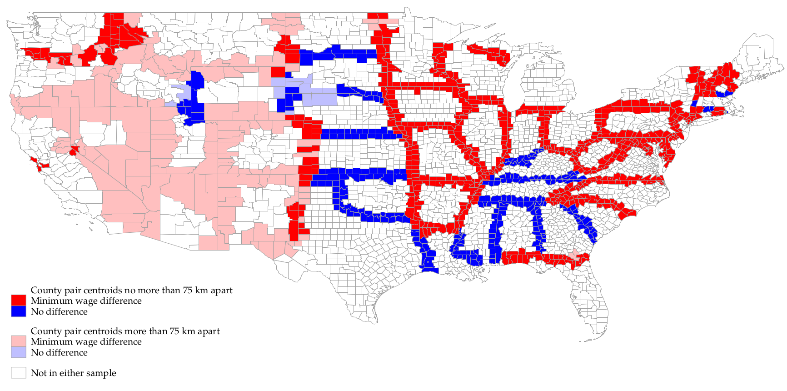
* DLR (2010) found large increases in restaurant earnings with no fall in employment
---

# Recent developments
The new generation of Card-Krueger-inspired work used transparent, local comparisons (good!) ... BUT ...

1. Much of this work focused on restaurants or teenagers, a minority of low-wage workers

2. Also much of this work did not clearly show wage/employment changes where (and only where!) you would expect to see them at the bottom of wage distribution

3. Little research on how wage/employment effects may vary depending on whether the minimum wage increases are large or small

 
CDLZ (2019) develops methods to address these weaknesses:

* Examines 138 state-level minimum wage increases
* calculate employment effects throughout the entire distribution
* assesses overall employment and wage impact for low-wage workers

---
# Wage distribution - no minimum wage
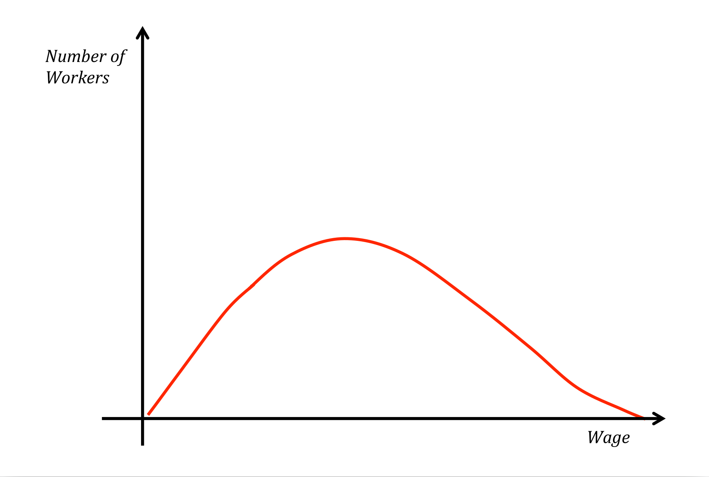
---
# Wage distribution - with minimum wage
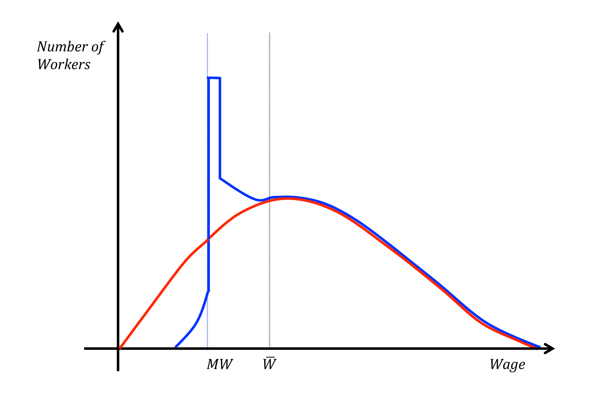
---
# Missing jobs below
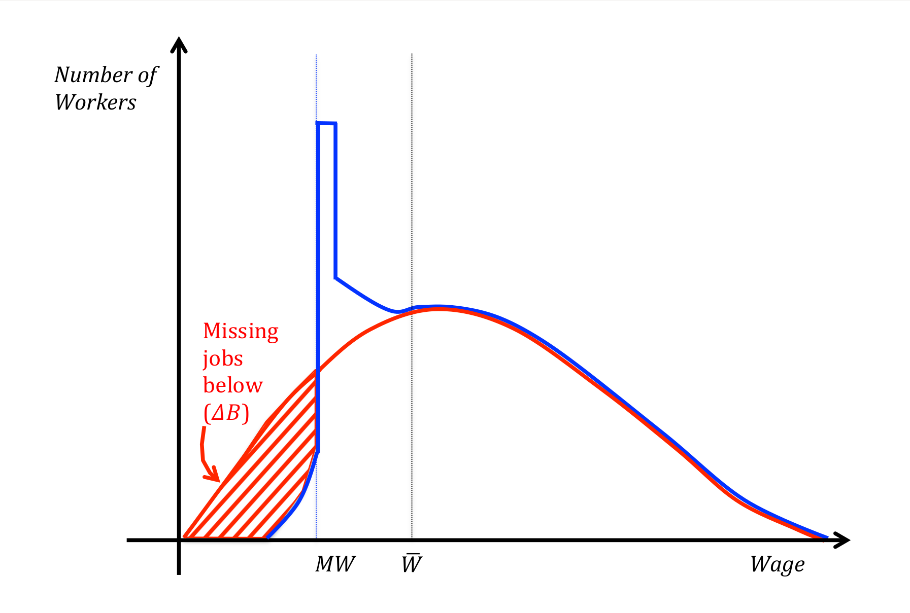
---
# Excess jobs above
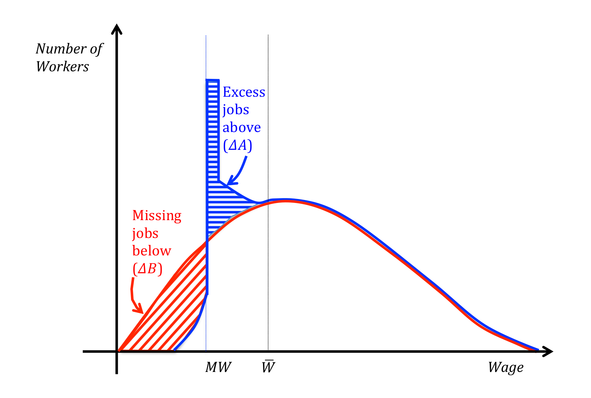
---
# "Bunching" estimate of emp effects
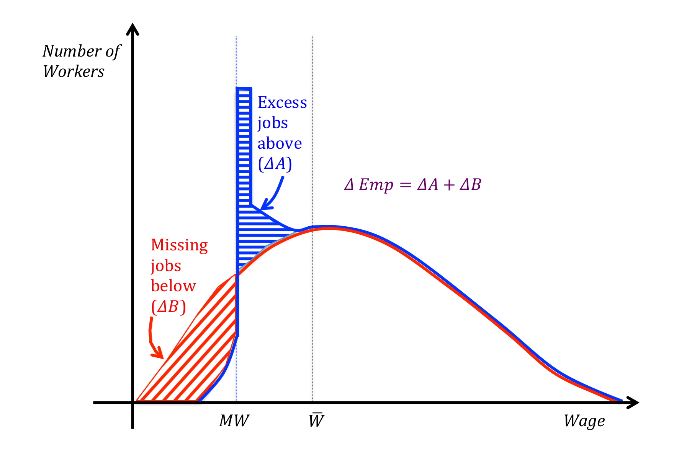
---
# Findings for 138 case studies
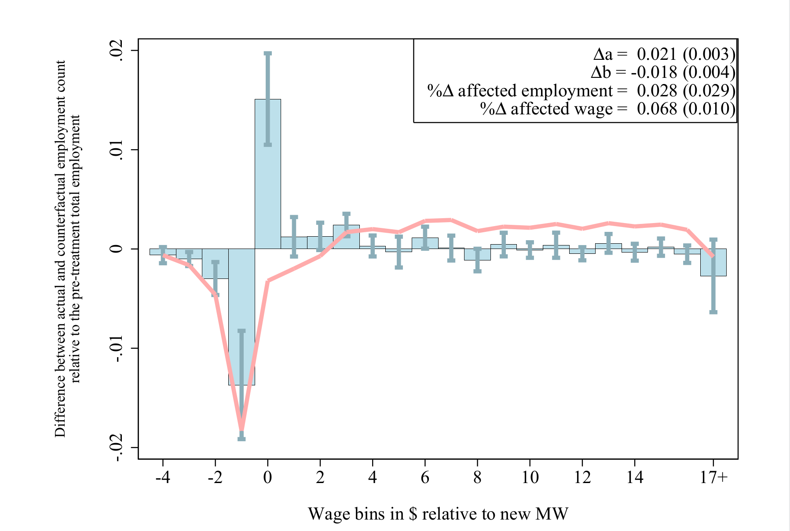

---
# Own-wage elasticity
### Basic definition
How does employment of group of workers respond to an increase in the average wage of that group induced by the minimum wage?

$$OWE = \frac{\textrm{% employment change}}{\textrm{% average wage change}}$$
 
### Hypothetical example OWE = -0.20 
* Implies 10% increase in hourly wages reduces employment by 2%
* This means total wage bill rises by about 10% - 2% = 8%
* Total wage income rises when OWE > -1 
* Dube (2019) suggests OWE < -0.4 is "small"

---
# Dube Lester Reich (2010) main result
In practice you may see 
$$OWE = \frac{\left(\frac{\textrm{% employment change}}{\textrm{% minimum wage change}}\right)}{\left(\frac{\textrm{% average wage change}}{\textrm{% minimum wage change}}\right)}$$
 
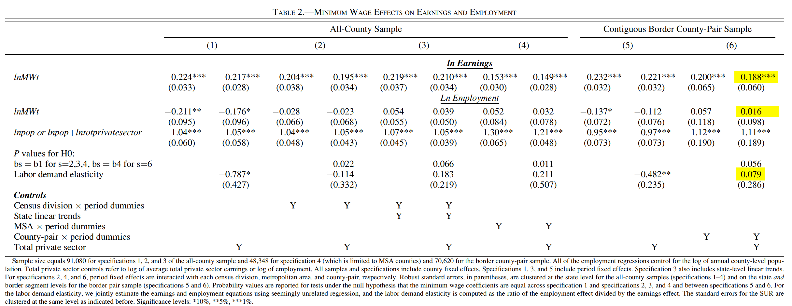

---
# Review of existing OWE estimates

.pull-left[
#### Dube (2019) review for UK Government
- 55 studies since Card & Krueger (1994) that calculate OWE
- Median OWE, any group = -0.17
- Median OWE, low-wage workers = -0.04
- 70% of estimates "small"
- only 4 studies with OWE < -1

 
#### CBO (2021)'s evaluation of $15 in 2025
- Assumed low-wage OWE = -0.48 (**!!**)
- Job loss from $15 in 2025 $\Rightarrow$ 1,400,000
- But Dube (2019)'s estimates $\Rightarrow$ 116,000
]
.pull-right[
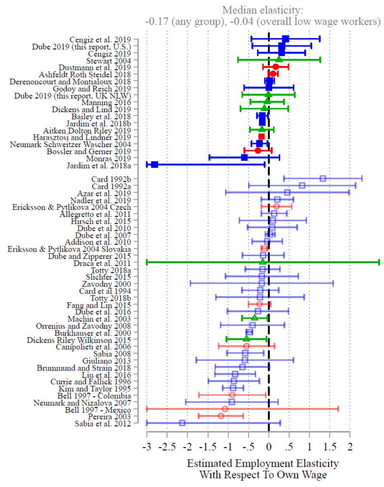
]

---
class: inverse, center, middle
# Labor market adjustments

---
### How does the labor market adjust?

#### Why are job losses relatively rare after minimum wage increases?
- Schmitt (2015) explains several "channels of adjustment"
- Today focus on Turnover, Prices, Reallocation.
- 
